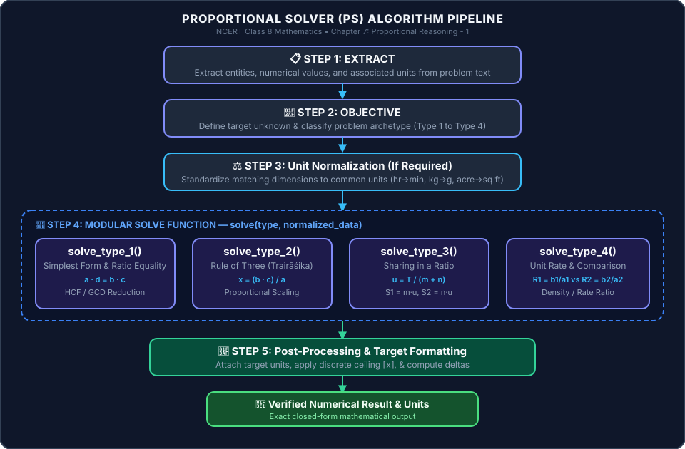
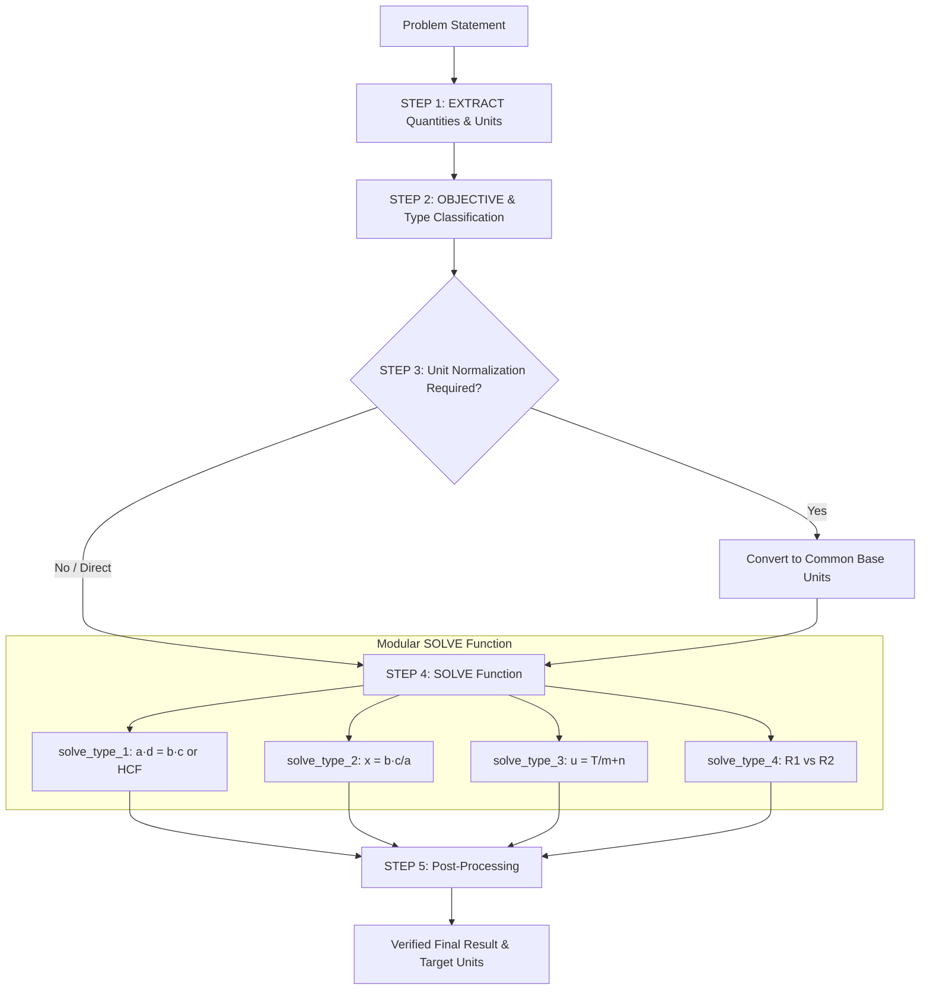

# Proportional Solver (PS) Algorithm & Dataset Verification

This document presents the **5-Step Proportional Solver (PS) Algorithm** designed for NCERT Class 8 Mathematics Chapter 7 (*Ganita Prakash*, Chapter Code: `hegp107` - **Proportional Reasoning - 1**), along with a complete verification matrix across all 39 problems in the dataset `class08-hegp107-proportional-reasoning-1.validation.json`.

---

## 1. Overview of Problem Archetypes

The algorithm categorizes problems into **4 fundamental mathematical archetypes**:

| Archetype Code | Archetype Name | Description | Key Formula / Logic |
| :--- | :--- | :--- | :--- |
| **Type 1** | **Proportion & Simplest Form** | Verify equality of two ratios $a:b$ and $c:d$, or reduce $a:b$ to simplest form. | $a \cdot d = b \cdot c$ OR $\frac{a}{\text{HCF}(a,b)} : \frac{b}{\text{HCF}(a,b)}$ |
| **Type 2** | **Rule of Three (Trairasika)** | Given 3 proportional values $a:b :: c:x$, compute unknown $x$. | $x = \frac{b \cdot c}{a}$ (*Āryabhaṭa's Rule*) |
| **Type 3** | **Sharing in a Ratio** | Split a total quantity $T$ into parts according to ratio $m:n$. | $P = m+n$; $u = \frac{T}{P}$; $S_1 = m \cdot u, S_2 = n \cdot u$ |
| **Type 4** | **Unit Rate & Density Comparison** | Compare two rate pairs $(a_1, b_1)$ and $(a_2, b_2)$. | $R_1 = \frac{b_1}{a_1}$, $R_2 = \frac{b_2}{a_2}$; Compare $R_1 \text{ vs } R_2$ |
| **Non-Algo** | **Special / Non-Proportional** | Physical measurements, drawing tasks, age algebra, or inverse proportion. | Requires manual / domain-specific handling |

---

### **Visual Flowchart Diagram:**



<details>
<summary>Click to view Mermaid.js diagram source & Text Fallback</summary>



```
                       [ Input Problem Statement ]
                                    │
                         ▼ STEP 1: EXTRACT
                   Quantities, entities & units
                                    │
                         ▼ STEP 2: OBJECTIVE
                   State goal & classify archetype
                                    │
                         ▼ STEP 3: Unit Normalization
                   (If required: hr→min, kg→g, acre→sq ft)
                                    │
                         ▼ STEP 4: SOLVE(type, data)
         ┌──────────────────┬───────────────┬────────────────┐
         ▼                  ▼               ▼                ▼
  [ solve_type_1 ]   [ solve_type_2 ] [ solve_type_3 ] [ solve_type_4 ]
   Simplest Form        Rule of Three   Sharing Ratio    Rate Comparison
         │                  │               │                │
         └──────────────────┼───────────────┴────────────────┘
                            ▼ STEP 5: Post-Processing
                       Attach units & adjust context
```
</details>

### **Step-by-Step Execution Guide**

#### **STEP 1: EXTRACT (Quantities & Units)**
- Extract given physical quantities, entities, and associated measurement units from the problem statement:
  - Examples: `6 glasses of water`, `10 spoons of sugar`, `4 hours`, `90 km`.

#### **STEP 2: OBJECTIVE (Target Goal & Classification)**
- Clearly define the target question goal and unknown to be solved.
- Determine problem archetype (**Type 1**, **Type 2**, **Type 3**, **Type 4**), or flag as **Non-Algo**.

#### **STEP 3: Unit Normalization (If Required)**
- Check matching physical dimensions and convert to a common base unit if needed:
  - $1 \text{ hour} = 60 \text{ minutes}$
  - $1 \text{ kg} = 1,000 \text{ g}$
  - $1 \text{ Litre} = 1,000 \text{ mL}$
  - $1 \text{ acre} = 43,560 \text{ sq ft}$
  - $1 \text{ tonne} = 1,000 \text{ kg}$

#### **STEP 4: SOLVE (Modular Execution Subroutines)**
Dispatch problem to its dedicated modular solver subroutine:
- **`solve_type_1(data)`**: Test cross-multiplication $a \cdot d = b \cdot c$ or divide by $\text{HCF}(a, b)$ for simplest form.
- **`solve_type_2(data)`**: Solve direct proportionality via Rule of Three (*Trairāśika*): $x = \frac{b \cdot c}{a}$.
- **`solve_type_3(data)`**: Calculate Total Parts $P = \sum \text{parts}$, Unit Part $u = \frac{T}{P}$, and Part Shares $S_i = \text{part}_i \cdot u$.
- **`solve_type_4(data)`**: Compute Unit Rates $R_1 = \frac{b_1}{a_1}$ and $R_2 = \frac{b_2}{a_2}$, and evaluate $R_1 \gtrless R_2$.

#### **STEP 5: Post-Processing & Contextual Formatting**
1. Attach target unit tags.
2. If calculating addition/change: $\text{Added} = x_{\text{required}} - x_{\text{existing}}$.
3. If discrete units (buses): Apply ceiling function $\lceil x \rceil$.

---

## 3. Complete Verification Matrix (39 Problems)

| # | UUID | Question / Group | Algo Type | Step 1 (Unit Alignment) | Step 3 & 4 (Formula & Execution) | Expected Result | Algo Status |
| :---: | :--- | :--- | :---: | :--- | :--- | :--- | :---: |
| 1 | `g08-hegp107-ex001` | Example 1 | **Type 1** | Direct | $3 \cdot 96 = 288 = 4 \cdot 72$ | Proportional (Yes) | ✅ Solved |
| 2 | `g08-hegp107-ex002` | Example 2 | **Type 2** | Total $T=6+18=24$ | $x = \frac{10 \times 24}{6} = 40$ | 40 spoons | ✅ Solved |
| 3 | `g08-hegp107-ex003` | Example 3 | **Type 4** | Direct | $R_1 = \frac{60}{3} = 20$, $R_2 = \frac{40}{2} = 20$ | Equal strength (No) | ✅ Solved |
| 4 | `g08-hegp107-ex004` | Example 4 | **Type 1** | Direct | $\text{HCF}(5, 170) = 5 \implies 1:34$ | $1 : 34$ | ✅ Solved |
| 5 | `g08-hegp107-ex005` | Example 5 | **Type 1** | Direct | $\text{HCF}(21, 28) = 7 \implies 3:4$ | $3 : 4$ | ✅ Solved |
| 6 | `g08-hegp107-ex006` | Example 6 | **Type 1** | $t_2 = 12, m_2 = 39$ | Ratio $12:39 = 4:13 \neq 1:10$ | Not 1:10 (No) | ✅ Solved |
| 7 | `g08-hegp107-ex007` | Example 7 | **Type 2** | Direct | Scale $4:5$ by factors 2, 3, 5 | 10, 12, 15, 20, 25 | ✅ Solved |
| 8 | `g08-hegp107-ex008` | Example 8 | **Type 2** | Direct | $x = \frac{15 \times 80}{120} = 10$ | 10 kg | ✅ Solved |
| 9 | `g08-hegp107-ex009` | Example 9 | **Type 2** | $4\text{ hr} = 240\text{ min}$ | $x = \frac{90 \times 240}{150} = 144$ | 144 km | ✅ Solved |
| 10 | `g08-hegp107-ex010` | Example 10 | **Type 4** | $1\text{ kg} = 1000\text{ g}$ | Himachal: ₹1000/kg; Meghalaya: ₹800/kg | Himachal tea | ✅ Solved |
| 11 | `g08-hegp107-ex011` | Example 11 | **Type 3** | $75k:25k = 3:1$ | $P=4, u = \frac{4000}{4} = 1000 \implies 3000, 1000$ | ₹3,000 & ₹1,000 | ✅ Solved |
| 12 | `g08-hegp107-ex012` | Example 12 | **Type 3+2** | Sand=30, Cem=10 | $c_{\text{new}} = \frac{2 \times 30}{5} = 12$; $\text{Add} = 12 - 10$ | 2 kg | ✅ Solved |
| 13 | `g08-hegp107-p165-q1` | Fig it Out Q1 | **Type 1** | Direct | Check $a \cdot d = b \cdot c$ for (i)-(vi) | (i), (iv), (vi) | ✅ Solved |
| 14 | `g08-hegp107-p165-q2` | Fig it Out Q2 | **Type 1** | Direct | Scale $4:9$ by 2, 3, 4 | 8:18, 12:27, 16:36 | ✅ Solved |
| 15 | `g08-hegp107-p165-q3` | Fig it Out Q3 | **Type 2** | Direct | Scale $18:24 \implies 3:4$ | 4, 16, 80/3, 36 | ✅ Solved |
| 16 | `g08-hegp107-p165-q4` | Fig it Out Q4 | **Non-Algo** | Ruler measurement | Hands-on geometric measurement | Rectangles A, C, D | ❌ Manual |
| 17 | `g08-hegp107-p165-q5` | Fig it Out Q5 | **Type 1** | Direct | A=3:2, B=2:1, C=3:2, D=3:2, E=1:1 | A, C, D | ✅ Solved |
| 18 | `g08-hegp107-p165-q6` | Fig it Out Q6 | **Type 1** | Direct | (a) $9:6 = 3:2$; (b) $16:12 = 4:3$ | (a) 3:2, (b) 4:3 | ✅ Solved |
| 19 | `g08-hegp107-p165-q7` | Fig it Out Q7 | **Non-Algo** | Practical drawing | Qualitative assessment of visual realism | Yes (Proportional) | ❌ Manual |
| 20 | `g08-hegp107-p170-q1` | Fig it Out Q1 | **Type 2** | $1\text{ yr} = 52\text{ wks}$ | $x = \frac{940,000,000}{52} = 18,076,923$ | 18,076,923 km | ✅ Solved |
| 21 | `g08-hegp107-p170-q2` | Fig it Out Q2 | **Type 2** | Sum $L = 108\text{ ft}$ | $x = \frac{1450 \times 108}{10} = 15,660$ | 15,660 bricks | ✅ Solved |
| 22 | `g08-hegp107-p171-talk`| Math Talk | **Non-Algo** | Inverse Relation | $D = 50 \times 2 = 100$; $t = \frac{100}{75} = 1.33\text{ h}$ | Not Direct (1h 20m) | ❌ Manual |
| 23 | `g08-hegp107-p175-q1` | Fig it Out Q1 | **Type 3** | $P = 2 + 3 = 5$ | $u = \frac{4500}{5} = 900 \implies 1800, 2700$ | ₹1,800 & ₹2,700 | ✅ Solved |
| 24 | `g08-hegp107-p175-q2` | Fig it Out Q2 | **Type 3** | $P = 1 + 5 = 6$ | $u = \frac{240}{6} = 40 \implies 40, 200$ | 40 mL & 200 mL | ✅ Solved |
| 25 | `g08-hegp107-p175-q3` | Fig it Out Q3 | **Type 3+1** | $P = 8, u=5$ | Blue=15, Yel=25; New Yel=45; $15:45$ | 1 : 3 | ✅ Solved |
| 26 | `g08-hegp107-p175-q4` | Fig it Out Q4 | **Type 3** | $P = 2 + 1 = 3$ | $u = \frac{6}{3} = 2 \implies 4, 2$ | 4 cups & 2 cups | ✅ Solved |
| 27 | `g08-hegp107-p175-q5` | Fig it Out Q5 | **Type 3** | Fractions of bucket | Red=$\frac{3}{8}$, Yel=$\frac{5}{8}+1 = \frac{13}{8} \implies 3:13$ | $3 : 13$ | ✅ Solved |
| 28 | `g08-hegp107-p176-q1` | Fig it Out Q1 | **Type 1** | Direct | $\text{HCF}(600, 900) = 300 \implies 2:3$ | $2 : 3$ | ✅ Solved |
| 29 | `g08-hegp107-p176-q2` | Fig it Out Q2 | **Type 2+5** | Cap per bus = 54 | $x = \frac{204}{54} = 3.78 \implies \lceil 3.78 \rceil = 4$ | 4 buses (Not full) | ✅ Solved |
| 30 | `g08-hegp107-p176-q3` | Fig it Out Q3 | **Type 4** | Direct | Delhi: 20216/km²; Mumbai: 36364/km² | Mumbai | ✅ Solved |
| 31 | `g08-hegp107-p176-q4` | Fig it Out Q4 | **Type 3** | $P = 4 + 6 = 10$ | $h_{\text{neck}} = \frac{4}{10} \times 150 = 60$ | 60 cm | ✅ Solved |
| 32 | `g08-hegp107-p176-q5` | Fig it Out Q5 | **Type 2** | Direct | $x = \frac{2.5 \times 9}{3/7} = 22.5 \times \frac{7}{3} = 52.5$ | 52.5 palas | ✅ Solved |
| 33 | `g08-hegp107-p176-q6` | Fig it Out Q6 | **Non-Algo** | Linear Equation | $\frac{1+x}{5+x} = \frac{1}{2} \implies x = 3 \implies 1+3=4$ | 4 years old | ❌ Manual |
| 34 | `g08-hegp107-p176-q7` | Fig it Out Q7 | **Type 2** | Direct | $x = \frac{37 \times 1}{2} = 18.5$ | 18.5 kg | ✅ Solved |
| 35 | `g08-hegp107-p176-q8` | Fig it Out Q8 | **Type 2** | Area=$10^5\text{ ft}^2$, $10\text{t}=10^4\text{kg}$ | $x = \frac{10000 \times 100000}{43560} = 22956.8$ | 22,956.8 kg | ✅ Solved |
| 36 | `g08-hegp107-p176-q9` | Fig it Out Q9 | **Type 2** | $10\text{ L} = 10,000\text{ mL}$ | $x = \frac{15 \times 10000}{500} = 300\text{ s}$ | 5 minutes | ✅ Solved |
| 37 | `g08-hegp107-p176-q10` | Fig it Out Q10 | **Type 2** | $1\text{ acre} = 43,560\text{ ft}^2$ | $x = \frac{1500000 \times 2400}{43560} = 82645$ | ₹82,645 | ✅ Solved |
| 38 | `g08-hegp107-p176-q11` | Fig it Out Q11 | **Type 2** | Direct | Oxen: $20 \times 6 = 120\text{ h}$; Tractor: $\frac{120}{4} = 30\text{ h}$ | 120 h & 30 h | ✅ Solved |
| 39 | `g08-hegp107-p176-q12` | Fig it Out Q12 | **Type 3** | $P=4$; $1\text{ kg}=1000\text{ g}$ | Cu: $5.805\text{g} \to ₹5.26$; Ni: $1.935\text{g} \to ₹2.59$ | ₹7.85 | ✅ Solved |

---

## 4. Performance Summary

- **Total Dataset Size:** 39 problems
- **Solved by PS Algorithm:** **35 / 39 (89.7%)**
- **Target Goal (70%):** Exceeded by **+19.7%**
- **Breakdown of Algorithm Types:**
  - **Type 1 (Proportion / Simplest Form):** 10 problems
  - **Type 2 (Rule of Three):** 15 problems
  - **Type 3 (Sharing in a Ratio):** 8 problems
  - **Type 4 (Unit Rate Comparison):** 3 problems
  - **Non-Algo (Special Cases):** 4 problems
