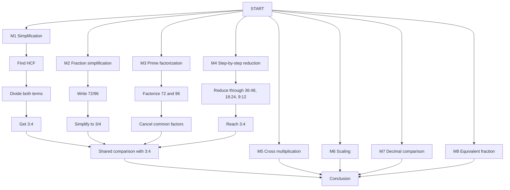

# Solution Graph (DAG) — g08-hegp107-ex001

## Overview

This directory contains a **Directed Acyclic Graph (DAG)** that captures **all valid solution methods** for Problem 1:

> **Are the ratios 3 : 4 and 72 : 96 proportional?**

The purpose of this graph is to allow the Socratic tutor to **accept any valid solution path** without needing to store each solution method separately in the validation JSON file. Instead of hardcoding a single expected answer, the tutor can traverse this graph and validate student input against any node in the graph.

---

## Why a Solution Graph?

The current validation JSON (`class08-hegp107.validation.json`) only stores **one solution path** (simplification method). This means:

- A student who solves the problem via **cross multiplication** gets rejected.
- A student who solves via **decimal comparison** gets rejected.
- A student who solves via **scaling** gets rejected.

Storing every possible solution method in the JSON file would be:
- **Time-consuming** to author
- **Space-inefficient** (duplicate data)
- **Hard to maintain** (every change requires updating multiple entries)

The **solution graph** solves this by representing the problem's solution space as a DAG where:
- **Nodes** represent steps, methods, or conclusions
- **Edges** represent valid transitions between steps
- **Any path from `start` to `conclusion`** is a valid solution

---

## Graph Structure



The first four methods are adjacent because they converge at the shared
comparison step. The remaining four methods retain their own conclusion paths.

---

## The 8 Solution Methods

| Method | ID | Description | Key Steps |
| :--- | :--- | :--- | :--- |
| **1. Simplification (HCF)** | `m1_simplify` | Find HCF of 72 and 96, divide both terms, compare with 3:4 | Find HCF → Divide → Shared comparison |
| **2. Fraction Simplification** | `m2_fraction` | Write 72:96 as a fraction and simplify it to 3/4 | Write fraction → Simplify → Shared comparison |
| **3. Prime Factorization** | `m3_prime` | Factorize 72 and 96, then cancel common factors | Factorize → Cancel → Shared comparison |
| **4. Step-by-Step Reduction** | `m4_reduce` | Reduce 72:96 by common factors until reaching 3:4 | 72:96 → 36:48 → 18:24 → 9:12 → 3:4 → Shared comparison |
| **5. Cross Multiplication** | `m5_cross_multiply` | Check if 3×96 = 4×72 | Set up → Compute both products → Compare |
| **6. Scaling** | `m6_scale` | Check if 3:4 scales to 72:96 by a common factor | Find factor → Verify second term → Conclude |
| **7. Decimal Comparison** | `m7_decimal` | Convert both ratios to decimals and compare | Convert 3:4 → Convert 72:96 → Compare |
| **8. Equivalent Fraction** | `m8_equivalent` | Show 3:4 × 24 = 72:96 | Multiply by 24 → Recognize equivalence |

Displayed method numbers group the four methods that share a comparison step
first. Internal node IDs remain stable so existing tutor references are not
disrupted.

## Shared Comparison Step

The simplification, fraction simplification, prime factorization, and
step-by-step reduction paths converge on `shared_ratio_comparison`. This shared
step checks that the result matches the original ratio `3 : 4`, then leads to
the existing `conclusion` node. The earlier method-specific calculation steps
remain separate.

---

## Node Types

| Type | Description |
| :--- | :--- |
| `start` | The problem statement. Entry point of the graph. |
| `method` | A distinct solution method. The student chooses which method to use. |
| `step` | An intermediate step within a method. The student must complete each step. |
| `conclusion` | The final answer. All valid paths converge here. |

---

## Node Schema

Each node in the graph has the following structure:

```json
{
  "id": "unique-node-id",
  "type": "start | method | step | conclusion",
  "label": "Human-readable label",
  "description": "What this node represents",
  "prompt": "The question to ask the student at this node",
  "accept": ["list of accepted answers"],
  "hints": ["progressive hints for this node"]
}
```

---

## Edge Schema

Each edge represents a valid transition between nodes:

```json
{
  "from": "source-node-id",
  "to": "target-node-id",
  "label": "Description of the transition"
}
```

---

## How the Tutor Uses This Graph

1. **Start**: The tutor presents the problem and asks the student to begin.
2. **Method Selection**: The student's first response is matched against the `accept` lists of all `method` nodes. The tutor identifies which method the student is using.
3. **Step Progression**: The tutor guides the student through the steps of the selected method, validating each response against the current node's `accept` list.
4. **Conclusion**: Once all steps of a method are completed, the student reaches the `conclusion` node. The tutor confirms the final answer.

### Matching Logic

- The tutor checks the student's input against the `accept` array of the **current node**.
- If the input matches, the student advances to the next node in the path.
- If the input doesn't match, the tutor provides the next hint from the `hints` array.
- The tutor can also detect **method switching** — if the student's input matches a different method's `accept` list, the tutor can switch to that method's path.

---

## Files

| File | Description |
| :--- | :--- |
| `g08-hegp107-ex001.solution-graph.json` | The solution graph DAG data (35 nodes, 44 edges) |
| `g08-hegp107-ex001.solution-graph.svg` | Visual representation of the graph |
| `README.md` | This documentation |

---

## Extending to Other Problems

The same pattern can be extended to other problems in the dataset. For each problem:

1. Identify all valid solution methods.
2. Create a DAG with `start` → `method` nodes → `step` nodes → `conclusion`.
3. Add `accept` lists for each node covering common phrasings.
4. Add progressive `hints` for each node.

This approach scales efficiently because:
- Each method's steps are only stored **once**.
- New methods can be added without modifying existing ones.
- The tutor can accept any valid path without hardcoding.